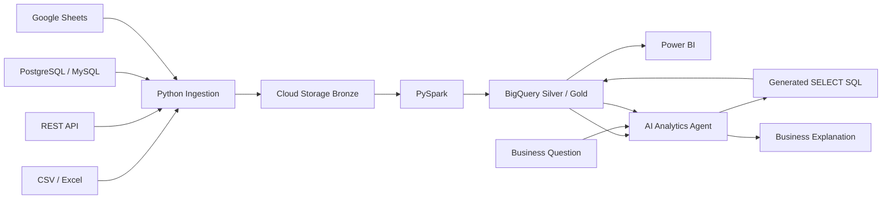

# Architecture

## Security boundary
The AI execution identity should have read-only BigQuery permissions. The application rejects mutation statements before execution and caps query bytes billed.

## Local-first development
The Streamlit dashboard works against the included synthetic dataset without cloud credentials. GCP deployment is an optional next step.

## Production flow
Bronze retains raw data for replay/audit. PySpark creates typed, deduplicated Silver data. BigQuery Gold exposes a star schema optimized with date partitioning and clustering. Power BI consumes curated tables. The AI layer translates natural-language questions into read-only SQL and explains the returned metrics.